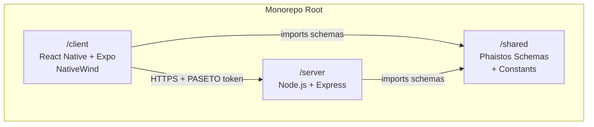
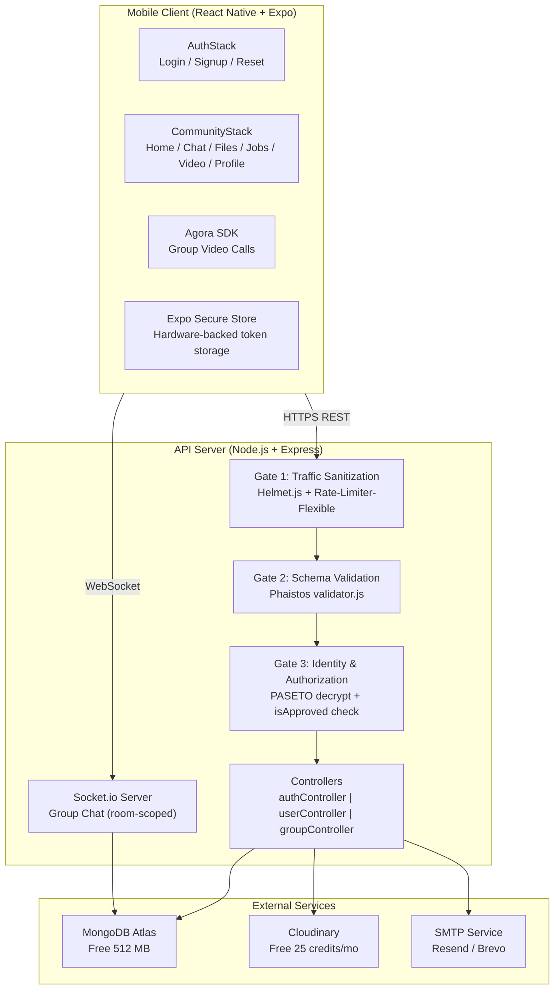
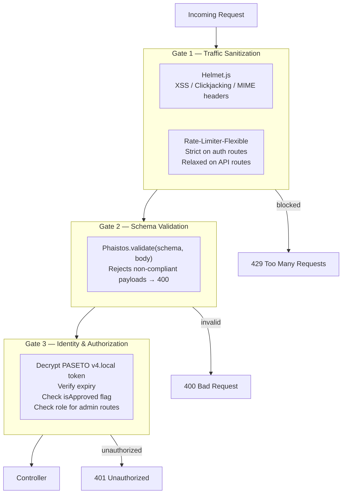
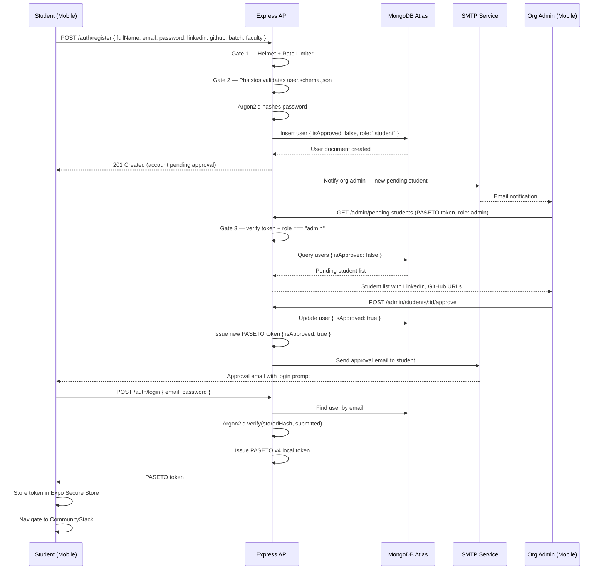
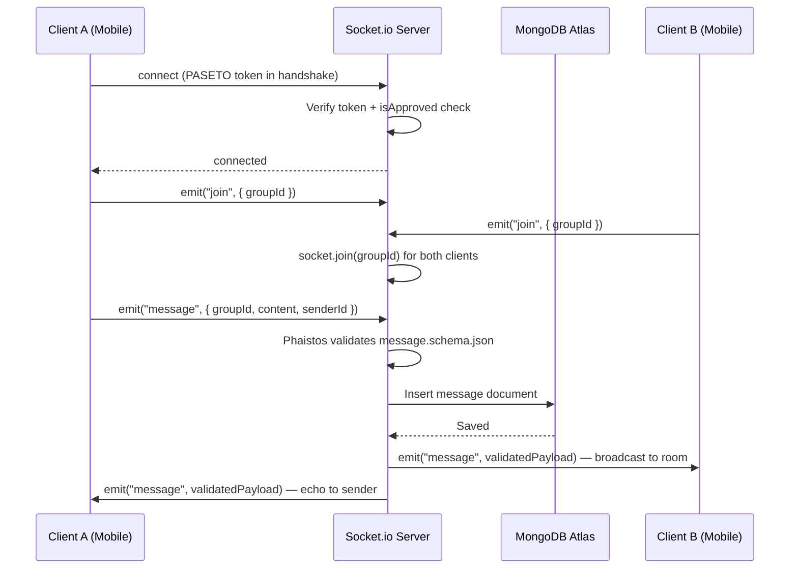
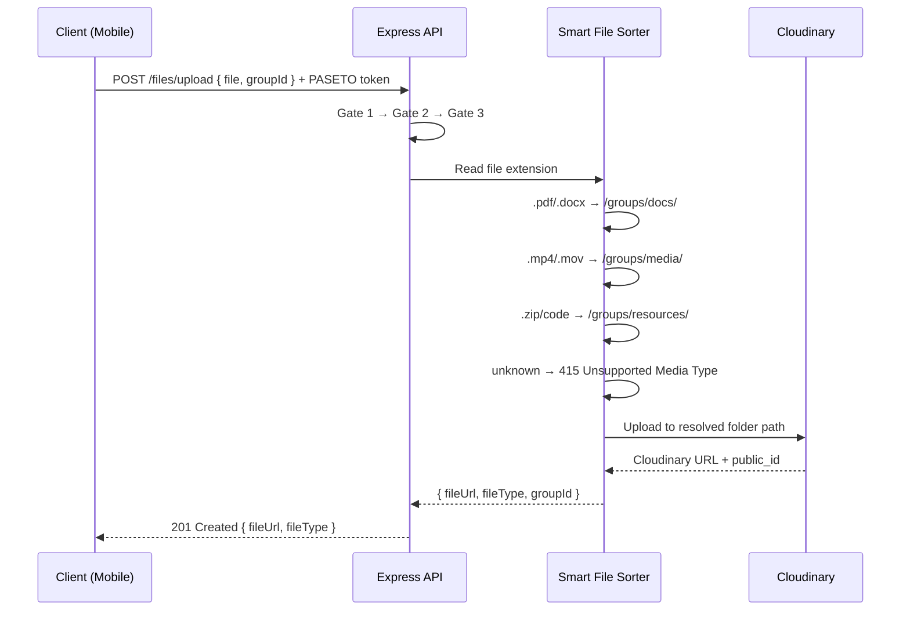

# Design Document: IT Community App

## Overview

The IT Community App is a mobile-first platform for IT students and organizations, built on a zero-budget stack with a security-first philosophy. It connects students to their organization through an approval-gated identity system, group-based real-time communication, structured file management, a job board, and live video — all enforced by a shared schema contract that spans both the mobile client and the Node.js backend simultaneously.

The architecture is a three-layer monorepo (`/client`, `/server`, `/shared`) where the `/shared` directory acts as the single source of truth for data shapes. Phaistos JSON schemas are imported by both the client-side validator and the server-side middleware, eliminating drift between frontend and backend expectations. Every request passes through a three-gate security pipeline before reaching any business logic: Traffic Sanitization → Schema Validation → Identity & Authorization.

---

## Architecture

### Monorepo Layer Overview



### High-Level System Architecture



### Three-Gate Security Pipeline



---

## Sequence Diagrams

### Student Registration & Approval Flow



### Group Chat Message Flow



### File Upload (Smart Sorter) Flow



---

## Components and Interfaces

### Component 1: AuthStack (Mobile)

**Purpose**: Handles all unauthenticated user flows — login, registration, and password reset.

**Screens**:
- `LoginScreen` — email/password form + OAuth buttons (Google, LinkedIn, GitHub)
- `SignupScreen` — full registration form validated client-side via Phaistos
- `ResetPasswordScreen` — email input to trigger password reset link

**Responsibilities**:
- Client-side Phaistos schema validation before any network call
- Write PASETO token to Expo Secure Store on successful login
- Route to `CommunityStack` when token is valid and `isApproved === true`
- Never render `CommunityStack` screens for unauthenticated sessions

---

### Component 2: CommunityStack (Mobile)

**Purpose**: The protected area of the app, accessible only to approved students.

**Screens** (Bottom Tab Navigator):

| Tab | Screen | Description |
|---|---|---|
| Home | `HomeScreen` | Groups overview — list of groups the student belongs to |
| Chat | `ChatScreen` | Socket.io group chat with real-time messages |
| Files | `FileGalleryScreen` | Tabbed gallery: Docs / Media / Resources per group |
| Jobs | `JobHubScreen` | Browse org-posted job opportunities with tag filters |
| Video | `VideoCallScreen` | Agora SDK group video call per group channel |
| Profile | `ProfileScreen` | Edit profile, update LinkedIn/GitHub, account settings |

**Responsibilities**:
- Read PASETO token from Expo Secure Store on every protected API call
- Attach token as `Authorization: Bearer <token>` header
- Handle 401 responses by clearing token and redirecting to `AuthStack`

---

### Component 3: API Gateway (Server)

**Purpose**: The Express server that receives all client requests and routes them through the three-gate security pipeline.

**Interface**:

```
Route Groups:
  POST   /auth/register
  POST   /auth/login
  POST   /auth/reset-password
  GET    /auth/oauth/:provider        (Google, LinkedIn, GitHub callbacks)

  GET    /admin/pending-students      [role: admin]
  POST   /admin/students/:id/approve  [role: admin]
  POST   /admin/students/:id/reject   [role: admin]

  GET    /groups                      [isApproved: true]
  GET    /groups/:id/messages         [isApproved: true]
  POST   /groups/:id/messages         [isApproved: true]

  POST   /files/upload                [isApproved: true]
  GET    /files/:groupId              [isApproved: true]

  GET    /jobs                        [isApproved: true]
  POST   /jobs                        [role: admin | organization]

  GET    /users/profile               [isApproved: true]
  PUT    /users/profile               [isApproved: true]
```

**Responsibilities**:
- Apply Helmet.js and Rate-Limiter-Flexible globally
- Run Phaistos schema validation on all request bodies
- Decrypt and verify PASETO tokens on all protected routes
- Enforce role-based access for admin and organization routes

---

### Component 4: Socket.io Server

**Purpose**: Manages real-time group chat connections, room membership, and message broadcasting.

**Interface**:

```
Events (Client → Server):
  authenticate  { token }           — verify PASETO on connection
  join          { groupId }         — join a Socket.io room
  message       { groupId, content, senderId }  — send a message
  leave         { groupId }         — leave a room

Events (Server → Client):
  connected     {}                  — authentication confirmed
  message       { ...messageDoc }   — broadcast to room members
  error         { message }         — validation or auth failure
```

**Responsibilities**:
- Verify PASETO token on every socket connection
- Scope all messages to `groupId` rooms — no private DMs
- Validate every message payload against `message.schema.json`
- Persist messages to MongoDB before broadcasting
- Paginate chat history on room join

---

### Component 5: Smart File Sorter (Server Middleware)

**Purpose**: Reads uploaded file extensions and routes them to the correct Cloudinary folder automatically.

**Routing Logic**:

| Extension | Category | Cloudinary Path |
|---|---|---|
| `.pdf`, `.docx` | Docs | `/groups/{groupId}/docs/` |
| `.mp4`, `.mov` | Media | `/groups/{groupId}/media/` |
| `.zip`, code files | Resources | `/groups/{groupId}/resources/` |
| Unknown | — | `415 Unsupported Media Type` |

**Responsibilities**:
- Intercept multipart file uploads before they reach the controller
- Resolve destination folder from file extension
- Upload to Cloudinary and return `{ fileUrl, fileType, publicId }`
- Reject unsupported file types with a `415` response

---

### Component 6: Admin Panel (Mobile)

**Purpose**: Restricted interface for organization admins to review and approve/reject pending student registrations.

**Screens**:
- Pending students list — shows `fullName`, `batch`, `faculty`, `linkedin`, `github`
- Student detail view — full profile for manual verification
- Approve / Reject actions — triggers `isApproved` update and email notification

**Responsibilities**:
- Only rendered when `role === "admin"` in the decoded token
- Surfaces LinkedIn and GitHub URLs for manual identity verification
- Triggers fresh PASETO token issuance on approval

---

## Data Models

### Model 1: User

```typescript
interface User {
  _id: ObjectId
  fullName: string           // required
  nickname?: string          // optional display name
  email: string              // required, unique, indexed
  passwordHash: string       // Argon2id hash, never plain text
  profilePicture?: string    // Cloudinary URL
  bio?: string
  dateOfBirth: Date          // required, ISO 8601
  batch: string              // required, e.g. "2022" or "2023–2025", indexed
  faculty: string            // required, indexed
  organizationName?: string  // links to Organization.organizationName
  linkedin: string           // required, must match linkedin.com/in/...
  github: string             // required, must match github.com/...
  isApproved: boolean        // default: false, indexed
  role: "student" | "admin" | "organization"
  oauthProviders: {
    google?: string          // OAuth provider user ID
    linkedin?: string
    github?: string
  }
  createdAt: Date
  updatedAt: Date
}
```

**Validation Rules**:
- `email` must be unique across the collection
- `linkedin` must match pattern `https://linkedin.com/in/[username]`
- `github` must match pattern `https://github.com/[username]`
- `passwordHash` is never returned in API responses
- `isApproved` defaults to `false` on registration; only admins can set it to `true`

**Indexes**: `email` (unique), `isApproved`, `batch`, `faculty`

---

### Model 2: Organization

```typescript
interface Organization {
  _id: ObjectId
  organizationName: string   // required, unique, indexed
  logo?: string              // Cloudinary URL
  establishedDate: Date      // required, ISO 8601
  location: string           // required
  website?: string           // full URL
  socials: {
    facebook?: string
    linkedin?: string
  }
  createdAt: Date
  updatedAt: Date
}
```

**Validation Rules**:
- `organizationName` must be unique
- `website` must be a valid fully-qualified URL if provided
- `establishedDate` must be a past date

**Indexes**: `organizationName` (unique)

---

### Model 3: Message

```typescript
interface Message {
  _id: ObjectId
  groupId: string            // required, indexed — scopes message to a group
  senderId: ObjectId         // required, ref: User
  content: string            // required, non-empty
  fileUrl?: string           // Cloudinary URL if message contains a file
  fileType?: "doc" | "media" | "resource"
  createdAt: Date            // indexed for pagination, TTL candidate
}
```

**Validation Rules**:
- `groupId` must be present — no messages without a group context
- `recipientId` field is explicitly forbidden (no private DMs)
- `content` must be non-empty string
- `fileType` must be one of the three allowed enum values if `fileUrl` is present

**Indexes**: `groupId`, `createdAt`

---

### Model 4: JobPost

```typescript
interface JobPost {
  _id: ObjectId
  groupId: string            // required, indexed
  postedBy: ObjectId         // required, ref: User (role: admin | organization)
  title: string              // required
  company: string            // required
  link: string               // required, fully-qualified URL
  tags: string[]             // required, min 1 tag, from approved enum list
  createdAt: Date
}
```

**Validation Rules**:
- `postedBy` user must have `role === "admin"` or `role === "organization"`
- `tags` must be from the approved enum: `["frontend", "backend", "fullstack", "mobile", "devops", "design", "internship", "remote", "part-time", "full-time"]`
- `link` must be a valid fully-qualified URL

**Indexes**: `groupId`, `tags`

---

### Shared Schema Contract (`/shared/schemas/`)

```
user.schema.json
  Required: fullName, email, password, dateOfBirth, batch, faculty, linkedin, github
  Patterns:
    linkedin → ^https://linkedin\.com/in/.+$
    github   → ^https://github\.com/.+$

organization.schema.json
  Required: organizationName, establishedDate, location
  Optional: logo, website, facebook, linkedin

message.schema.json
  Required: groupId, senderId, content
  Forbidden: recipientId (enforced by schema — no DMs)

jobPost.schema.json
  Required: title, company, link, tags[]
  Constraint: tags must be from approved enum list
```

---

## Error Handling

### Error Scenario 1: Schema Validation Failure (Gate 2)

**Condition**: Request body does not match the Phaistos schema for the endpoint.
**Response**: `400 Bad Request` with a structured error body listing the failing fields and constraints.
**Recovery**: Client displays field-level validation errors to the user. No retry without correcting the payload.

---

### Error Scenario 2: Unauthorized / Token Invalid (Gate 3)

**Condition**: PASETO token is absent, expired, or fails decryption. Or `isApproved === false` on a community route.
**Response**: `401 Unauthorized`
**Recovery**: Mobile client clears the token from Expo Secure Store and redirects the user to `AuthStack` (LoginScreen).

---

### Error Scenario 3: Insufficient Role (Gate 3)

**Condition**: A non-admin user attempts to access an admin-only route (e.g., `POST /admin/students/:id/approve`).
**Response**: `403 Forbidden`
**Recovery**: Client surfaces a "You don't have permission" message. No navigation change.

---

### Error Scenario 4: Rate Limit Exceeded (Gate 1)

**Condition**: A client exceeds the configured request threshold on auth routes (brute-force protection).
**Response**: `429 Too Many Requests` with a `Retry-After` header.
**Recovery**: Client displays a cooldown message. No retry until the window resets.

---

### Error Scenario 5: Unsupported File Type (Smart Sorter)

**Condition**: A file upload contains an extension not in the allowed list.
**Response**: `415 Unsupported Media Type`
**Recovery**: Client displays an error message listing the supported file types. No upload is attempted.

---

### Error Scenario 6: OAuth Provider Failure

**Condition**: OAuth callback from Google, LinkedIn, or GitHub fails or returns an error state.
**Response**: Redirect to `LoginScreen` with an error query parameter.
**Recovery**: Client displays "OAuth login failed, please try again" and offers the email/password fallback.

---

## Testing Strategy

### Unit Testing Approach

Test each controller, middleware, and utility function in isolation using mocked dependencies.

Key unit test areas:
- `authController` — registration, login, token issuance, password reset
- `authMiddleware` — token decryption, `isApproved` check, role check
- `validator.js` — Phaistos schema pass/fail for each schema type
- `rateLimiter.js` — threshold enforcement per route group
- Smart File Sorter — correct folder resolution per extension, 415 on unknown
- `tokenHelper.js` — Secure Store read/write/delete lifecycle

---

### Property-Based Testing Approach

Use property-based tests to verify invariants that hold across arbitrary inputs.

**Property Test Library**: `fast-check` (JavaScript/TypeScript)

Key properties to verify:

| Property | Description |
|---|---|
| Schema rejection completeness | For any payload missing a required field, Phaistos always returns a validation error |
| Argon2id round-trip | For any non-empty password string, `verify(hash(p), p)` always returns `true` |
| PASETO round-trip | For any valid payload object, `decrypt(encrypt(payload))` always equals the original payload |
| Smart Sorter determinism | For any file extension in the allowed set, the sorter always returns the same folder path |
| No DM leakage | For any message payload containing a `recipientId` field, schema validation always rejects it |
| Role gate exclusivity | For any token with `role !== "admin"`, admin routes always return 403 |
| isApproved gate | For any token with `isApproved === false`, community routes always return 401 |

---

### Integration Testing Approach

Test the full request pipeline end-to-end against a test MongoDB instance.

Key integration test flows:
- Full registration → pending → approval → login → token issuance cycle
- Group chat: connect → join room → send message → receive broadcast → persist to DB
- File upload: multipart form → Smart Sorter → Cloudinary mock → DB record
- Job post: org admin creates post → student queries with tag filter → correct results returned
- Admin rejection: student rejected → `isApproved` remains `false` → login returns 401

---

## Performance Considerations

- **MongoDB Indexes**: `email` (unique), `isApproved`, `batch`, `faculty`, `groupId`, `tags` — all query-critical fields are indexed to avoid collection scans on the free 512 MB Atlas tier.
- **Message Pagination**: Chat history is loaded in pages (e.g., 50 messages per page) on room join to avoid large payload transfers over mobile connections.
- **Cloudinary CDN**: All media is served via Cloudinary's CDN, offloading bandwidth from the Express server entirely.
- **TTL Index on Messages**: Old messages can be expired automatically via a MongoDB TTL index on `createdAt` to stay within the 512 MB Atlas free tier limit.
- **Rate Limiting**: Separate rate limit windows for auth routes (strict) and general API routes (relaxed) prevent a single abusive client from degrading service for others.
- **Socket.io Rooms**: Messages are scoped to `groupId` rooms — the server never broadcasts to all connected clients, keeping fan-out bounded.

---

## Security Considerations

- **PASETO v4.local**: Fully encrypted token payload using XChaCha20-Poly1305. Unlike JWT, the claims are invisible to the client and immune to algorithm-switching attacks.
- **Argon2id**: OWASP first-choice password hashing algorithm. Resistant to GPU cracking, side-channel attacks, and time-memory trade-off attacks. Never bcrypt or MD5.
- **Expo Secure Store**: PASETO tokens are stored in the device's hardware-backed Secure Enclave. Never in AsyncStorage, Redux, or Zustand state.
- **Phaistos Schema Enforcement**: Every request body is validated against a strict JSON schema before reaching any controller. Malformed or unexpected fields are rejected at Gate 2.
- **No Private DMs**: The `message.schema.json` explicitly forbids the `recipientId` field, enforcing group-only communication at the schema level.
- **isApproved Flag**: Students cannot access any community feature until an org admin explicitly approves their account. The flag is embedded in the encrypted PASETO token and re-verified on every request.
- **Helmet.js**: Sets `Content-Security-Policy`, `X-Frame-Options`, `X-Content-Type-Options`, and other security headers on every response.
- **Password Reset Tokens**: Single-use, stored with a MongoDB TTL index (15-minute expiry), invalidated immediately on use.
- **OAuth Fallback**: OAuth-linked accounts can still set a local password. LinkedIn and GitHub profile URLs remain mandatory regardless of sign-up method.
- **Environment Variables**: No secret ever appears in source code. All credentials (`PASETO_SECRET`, `MONGO_URI`, `CLOUDINARY_URL`, `AGORA_APP_ID`, `SMTP_KEY`) are injected via the hosting platform's environment variable system.

---

## Dependencies

### Client (`/client`)

| Package | Purpose |
|---|---|
| `react-native` + `expo` | Cross-platform mobile framework |
| `nativewind` | Tailwind CSS utility classes in React Native |
| `expo-secure-store` | Hardware-backed token storage |
| `@react-navigation/native` | Navigation container |
| `@react-navigation/stack` | Stack navigator (Auth / Community stacks) |
| `@react-navigation/bottom-tabs` | Bottom tab navigator |
| `axios` | HTTP client with interceptors |
| `socket.io-client` | Real-time WebSocket client |
| `agora-react-native-rtc` | Agora SDK for group video calls |
| `phaistos` | Client-side schema validation |
| `zustand` | Lightweight global state (auth store, chat store) |

### Server (`/server`)

| Package | Purpose |
|---|---|
| `express` | HTTP server and routing |
| `mongoose` | MongoDB ODM |
| `argon2` | Argon2id password hashing |
| `paseto` | PASETO v4.local token issue and verification |
| `socket.io` | Real-time WebSocket server |
| `cloudinary` | Cloudinary SDK for file uploads |
| `multer` | Multipart form data parsing for file uploads |
| `helmet` | Secure HTTP response headers |
| `rate-limiter-flexible` | Brute-force and abuse protection |
| `phaistos` | Server-side schema validation middleware |
| `nodemailer` / `resend` | Transactional email (approval, password reset) |

### Shared (`/shared`)

| File | Purpose |
|---|---|
| `schemas/user.schema.json` | User registration and profile payload contract |
| `schemas/organization.schema.json` | Organization creation and update payload contract |
| `schemas/message.schema.json` | Chat message payload contract (forbids recipientId) |
| `schemas/jobPost.schema.json` | Job post payload contract with tag enum |
| `constants/roles.js` | Role enum: `STUDENT`, `ADMIN`, `ORGANIZATION` |
| `constants/routes.js` | API route name constants |
| `constants/errorMessages.js` | Standardised error strings used on both client and server |
